<div align="center">


# Qyrex

**A central de trabalho para devs e freelancers.**<br>
Projetos, tarefas, arquivos, IA, clientes, marketing e agenda num app desktop só.

[](https://github.com/PQueirozDev/QrzSpace-releases/releases/latest)
[](https://github.com/PQueirozDev/QrzSpace-releases/releases)
[](https://github.com/PQueirozDev/QrzSpace-releases/releases/latest/download/Qyrex-Setup.exe)
[](LICENSE)

[**⬇ Baixar para Windows**](https://github.com/PQueirozDev/QrzSpace-releases/releases/latest/download/Qyrex-Setup.exe) ·
[Site](https://qyrexapp.vercel.app) ·
[Novidades](https://github.com/PQueirozDev/QrzSpace-releases/releases)

<br>

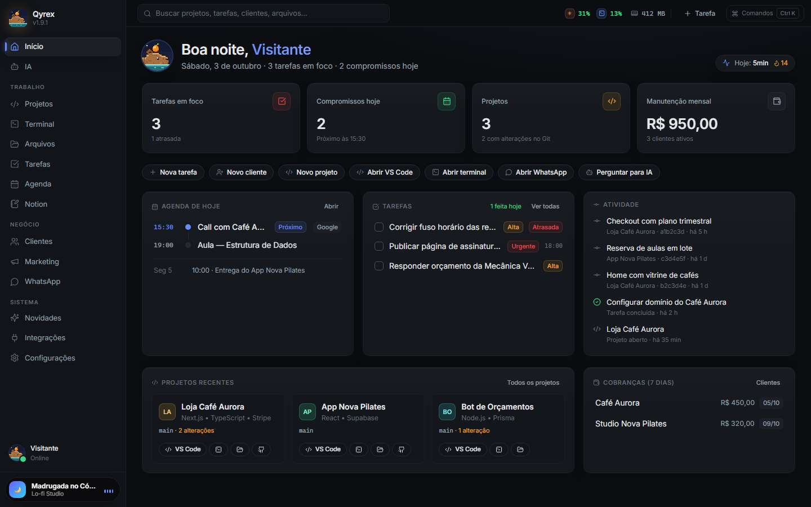

</div>

<br>

O Qyrex **orquestra** as ferramentas que você já usa (VS Code, terminal,
Explorer, GitHub, WhatsApp, Spotify) em vez de tentar substituí-las. Tudo fica
no seu PC: banco SQLite local, chaves no cofre do Windows e nenhuma conta
para criar.

## Telas

<table>
  <tr>
    <td width="50%">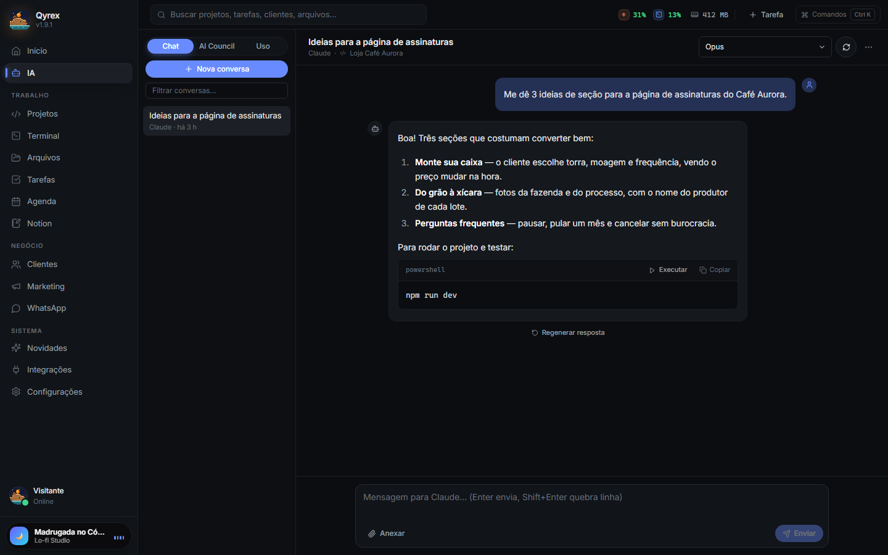<p align="center"><b>IA</b> · Claude, OpenAI e Gemini, com comandos executáveis</p></td>
    <td width="50%">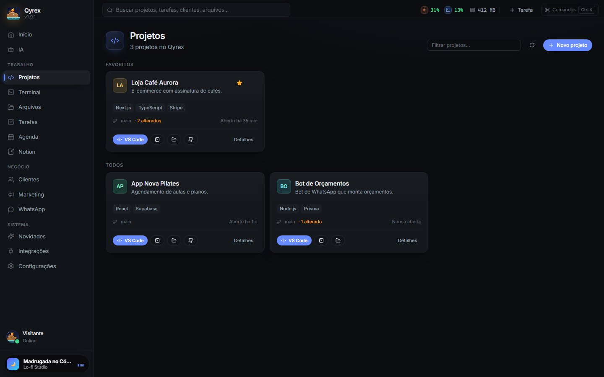<p align="center"><b>Projetos</b> · status do git, VS Code e terminal num clique</p></td>
  </tr>
  <tr>
    <td>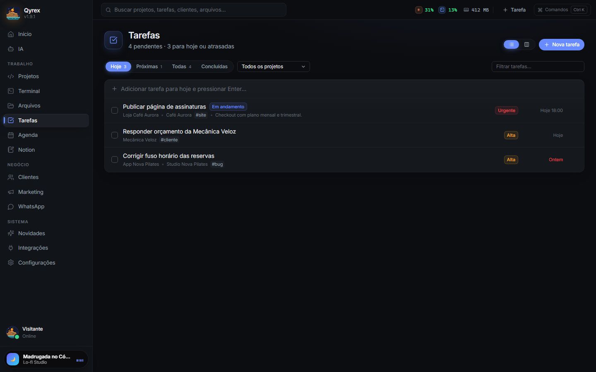<p align="center"><b>Tarefas</b> · lista ou kanban, com prazo e prioridade</p></td>
    <td>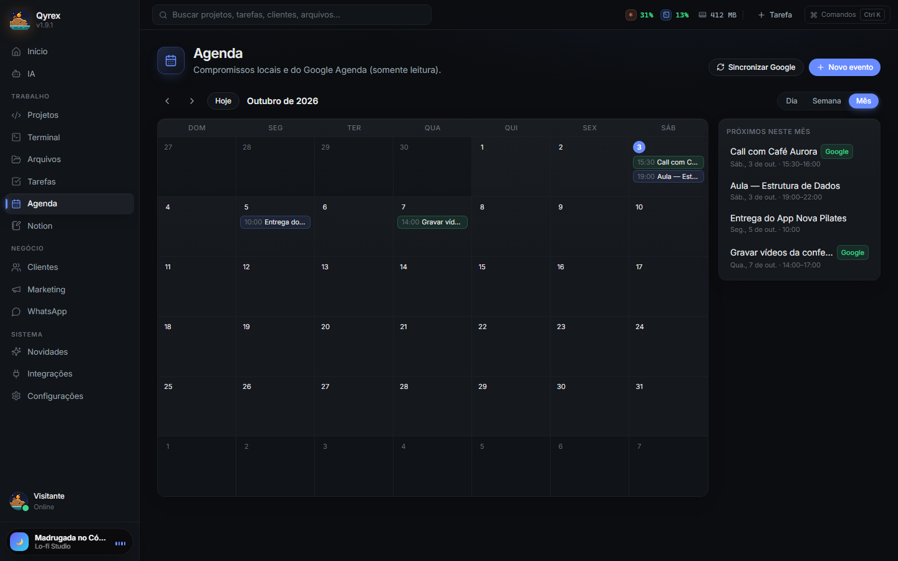<p align="center"><b>Agenda</b> · eventos locais e do Google Agenda</p></td>
  </tr>
  <tr>
    <td>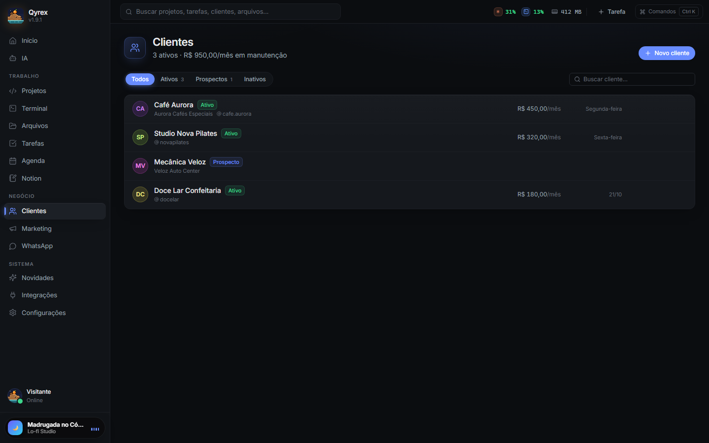<p align="center"><b>Clientes</b> · manutenção mensal e cobranças</p></td>
    <td>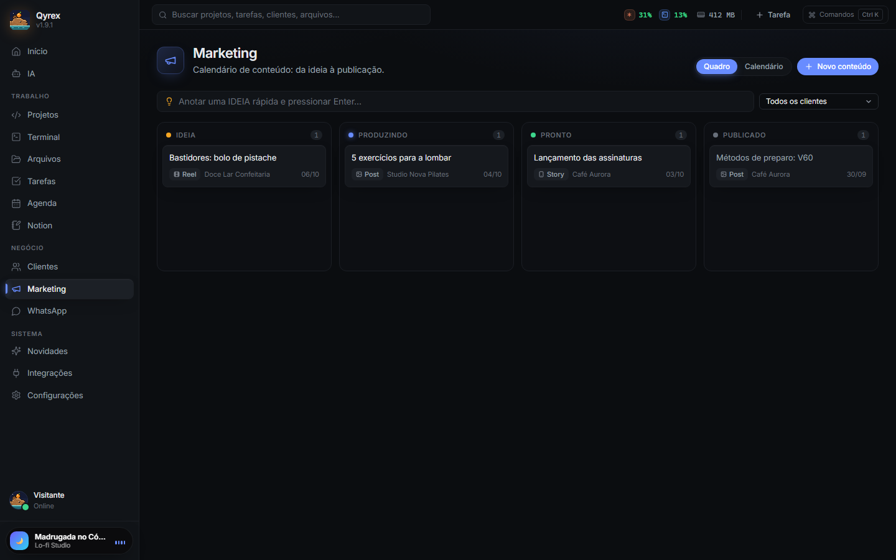<p align="center"><b>Marketing</b> · da ideia ao post publicado</p></td>
  </tr>
</table>

### Temas

<table>
  <tr>
    <td width="33%">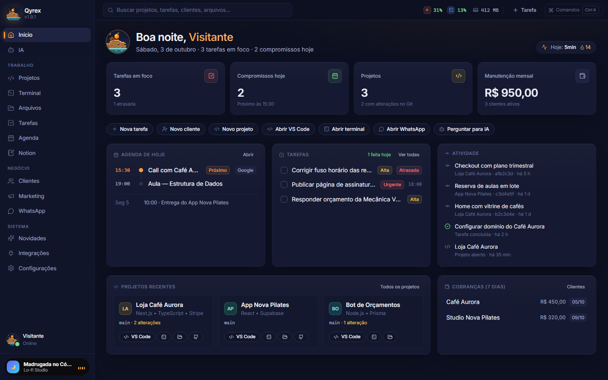<p align="center">Onsen</p></td>
    <td width="33%">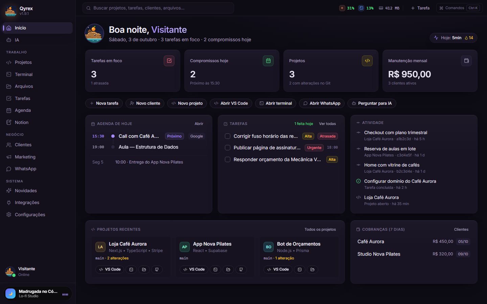<p align="center">Violeta</p></td>
    <td width="33%">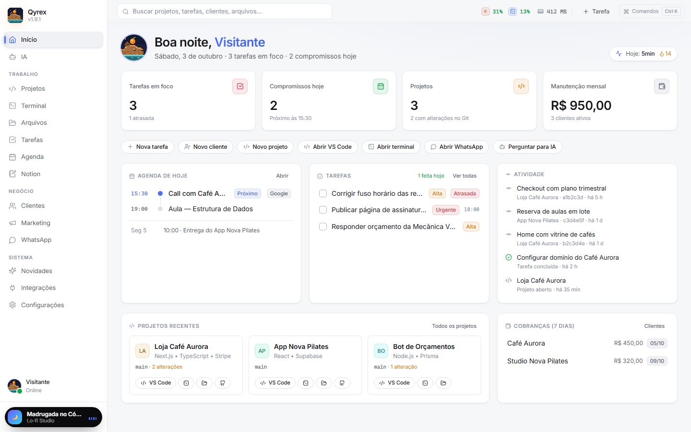<p align="center">Claro</p></td>
  </tr>
</table>

Também tem Escuro, Meia-noite, Areia e Sistema, escolhidos por prévia em
**Configurações → Aparência**.

## Funcionalidades

| | |
| --- | --- |
| 🏠 **Início** | Tarefas em foco, compromissos do dia, cobranças da semana, projetos e commits recentes, tempo de uso do app e ações rápidas. |
| 🧩 **Projetos** | Tecnologias detectadas pelo `package.json`, status do git, commit/pull/push com confirmação (push nunca com `--force`), issues e PRs do GitHub. |
| 💻 **Terminal** | xterm.js + node-pty com abas, PowerShell ou CMD, aberto na pasta do projeto. |
| 📁 **Arquivos** | Navegação só nas pastas autorizadas, busca, renomear/copiar/mover/excluir e preview de imagem, código e Markdown. |
| ✅ **Tarefas** | Lista (Hoje, Próximas, Todas, Concluídas) ou kanban, com prioridade, prazo, tags, projeto e cliente. `Ctrl+Shift+T` de qualquer lugar. |
| 📅 **Agenda** | Dia, semana e mês, com eventos locais e do Google Agenda. |
| 📝 **Notion** | Busca, leitura e criação de páginas, com "Perguntar à IA" sobre o conteúdo. |
| 🤝 **Clientes** | Status, manutenção mensal, próxima cobrança, pasta de arquivos e atalhos para WhatsApp, Instagram, email e telefone. |
| 📣 **Marketing** | Quadro Ideia → Produzindo → Pronto → Publicado, calendário semanal e captura rápida de ideias. |
| 💬 **WhatsApp** | Abre conversas pelo app desktop ou pelo WhatsApp Web, só com links oficiais. |
| 🤖 **IA** | Chat com Claude, OpenAI e Gemini (por API key ou pela sua assinatura do Claude Code/Codex), anexos explícitos, comandos com botão **Executar** e permissão, **AI Council** (vários modelos e uma síntese) e aba de uso de tokens. |
| 🎵 **Mini player** | Mostra e controla o que está tocando no Windows (Spotify, navegador etc.), com capa. |

E mais: Command Palette (`Ctrl+K`), bandeja do sistema, notificações,
interface em **português ou inglês**, foto de perfil, Discord Rich Presence
opcional, animação de abertura e **atualização automática** com conferência
de SHA-512.

## Download

Baixe o [**Qyrex-Setup.exe**](https://github.com/PQueirozDev/QrzSpace-releases/releases/latest/download/Qyrex-Setup.exe)
e siga o assistente. Não precisa de administrador, e depois de instalado o app
se atualiza sozinho.

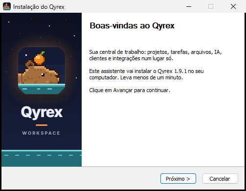

> O instalador ainda não é assinado digitalmente, então o SmartScreen pode
> avisar na primeira execução: clique em **Mais informações → Executar assim mesmo**.
>
> O app se chamava **QrzSpace** até a 1.6.2. Na primeira abertura da 1.7.0 em
> diante, os dados de `%APPDATA%/QrzSpace` são copiados para `%APPDATA%/Qyrex`.

## Configuração inicial

Na primeira execução, o onboarding pede seu nome e as pastas onde ficam seus
projetos (ex.: `C:\Projetos`). O Qyrex **só** lê, lista ou altera arquivos
dentro dessas pastas, e a lista fica em **Configurações → Pastas autorizadas**.

<details>
<summary><b>Integrações</b>: o que cada uma precisa</summary>

<br>

Tudo fica em **Integrações**. Cada chave ou token é guardado cifrado no cofre
do sistema e aparece na tela só mascarado.

| Integração | O que você precisa |
| --- | --- |
| Claude (Anthropic) | API key de [console.anthropic.com](https://console.anthropic.com/settings/keys) ou o [Claude Code](https://claude.com/claude-code) já logado no PC |
| OpenAI | API key de [platform.openai.com](https://platform.openai.com/api-keys) ou o Codex CLI já logado no PC |
| Gemini (Google) | API key do [Google AI Studio](https://aistudio.google.com/app/apikey) |
| GitHub | Fine-grained personal access token com leitura de Metadata, Issues e Pull requests, ou o `gh` já logado |
| Notion | Token de uma integração interna, com as páginas compartilhadas com ela |
| Google Agenda | No Google Cloud Console: ative a Google Calendar API e crie um OAuth Client do tipo **App para computador**. Informe o Client ID e o Client Secret. |
| Spotify (opcional) | No [Spotify Developer Dashboard](https://developer.spotify.com/dashboard), crie um app com o Redirect URI `http://127.0.0.1:43821/callback`. Só o Client ID é necessário (PKCE). |
| WhatsApp | Nada: usa os links oficiais (`wa.me` e o app desktop). |
| Discord (em Configurações) | Em [discord.com/developers](https://discord.com/developers/applications), crie um aplicativo chamado **Qyrex**, envie `build/icon.png` em Rich Presence → Art Assets com o nome `qyrex` e cole o Application ID. Precisa do app do Discord aberto. |

</details>

## Segurança

O Qyrex mexe em arquivos, roda comandos e guarda tokens, então a segurança é
regra, não detalhe:

- **Renderer isolado** (`contextIsolation`, `sandbox`, sem `nodeIntegration`). A interface só fala com o processo principal pela API de `src/preload/index.ts`.
- **Todo canal IPC** confere a origem e valida a entrada com zod.
- **Arquivos só nas pastas autorizadas**, com resolução de `..`, symlinks e junctions. Raiz de disco, pastas do sistema e a home inteira não podem ser autorizadas.
- **Processos** rodam com `spawn` (argumentos em array, `shell: false`). Input do usuário nunca vira pedaço de comando.
- **A IA nunca executa nada sozinha.** Comandos sugeridos pedem permissão, e os perigosos nunca podem ser "permitidos sempre".
- **Segredos só no cofre do Windows** (`safeStorage`/DPAPI): nunca no banco, na interface ou nos logs, que têm redação automática.
- **Ações sensíveis** (excluir, mover, commit, pull, push, executar) passam por um diálogo de confirmação.
- **Atualizações** vêm de origem fixa por HTTPS, com SHA-512 conferido e sem downgrade.

## Desenvolvimento

Pré-requisito: Node.js 20+ no Windows. `better-sqlite3` e `@lydell/node-pty`
vêm com binários prontos, sem Visual Studio Build Tools.

```bash
npm install
npm run dev:app      # Vite (5173) + Electron com hot reload
```

| Comando | O que faz |
| --- | --- |
| `npm run check` | typecheck + lint (sem warnings) + testes (vitest dentro do Electron) |
| `npm run e2e` | percorre o app inteiro pela interface, com as APIs simuladas |
| `npm run dist` | gera `release/Qyrex-Setup-<versão>.exe` (NSIS x64) |
| `npm run release` | `check` + build + publica a versão em [QrzSpace-releases](https://github.com/PQueirozDev/QrzSpace-releases) |
| `npm run build:demo` | demo web com a interface real e dados fictícios (`dist-demo/`) |
| `npm run screenshots` | refaz as imagens de `docs/screenshots/` a partir da demo |
| `npm run icons` | regenera ícones e artes do instalador a partir de `build/icon.svg` |

Se o binário do Electron não baixar no `npm install`, rode
`node node_modules/electron/install.js`.

**Nova versão:** suba a versão no `package.json`, adicione a entrada em
`src/shared/changelog.ts` (pt e en; o teste exige) e rode `npm run release`.
Os apps instalados encontram a versão nova ao abrir.

<details>
<summary><b>Estrutura do projeto</b></summary>

```
src/
  main/          # processo Electron: ipc, services, integrations, security, database
  preload/       # única ponte exposta ao renderer (contextBridge)
  renderer/      # React 18 + Tailwind: pages, components, stores, lib
  shared/        # tipos, i18n e changelog compartilhados
  demo/          # demo web com window.workspace simulado
tests/           # vitest: segurança, banco, IPC, arquivos e integrações
scripts/         # testes no Electron, E2E, release, ícones e screenshots
build/           # ícone e artes do instalador
site/            # site estático (qyrexapp.vercel.app)
docs/            # imagens do README
```

**Stack:** Electron · React 18 · TypeScript strict · Vite · Tailwind CSS ·
Zustand · motion · better-sqlite3 · zod · xterm.js + node-pty ·
@anthropic-ai/sdk · electron-updater · Vitest

</details>

## Pixel art

A capivara, o ícone, a cena do onsen do site e as artes do instalador são
desenhados em código, pixel a pixel, em
[`site/pixel/pixel.mjs`](site/pixel/pixel.mjs). Para mudar algo, edite o
script e rode `node site/pixel/pixel.mjs` e depois `npm run icons`.

## Roadmap

- [x] Projetos, tarefas, arquivos, palette, terminal e bandeja
- [x] IA com Claude, OpenAI e Gemini, AI Council e execução com permissão
- [x] Clientes, Marketing, Agenda, GitHub, Notion, WhatsApp e mini player
- [x] Temas, português/inglês, Discord e atualização automática
- [ ] WhatsApp Cloud API oficial (lembretes de cobrança e confirmações)
- [ ] Criar e editar eventos do Google Agenda pelo app
- [ ] Automações entre módulos (ex.: tarefa ao publicar conteúdo)

## Contribuir

Issues e pull requests são bem-vindos. Antes de abrir um PR, rode
`npm run check`. Textos novos na interface usam `tr()` com a tradução em
`src/shared/locales/en.ts` (o teste de i18n confere), e as regras de segurança
acima valem para qualquer mudança.

## Licença

[MIT](LICENSE) © Pedro Queiroz
